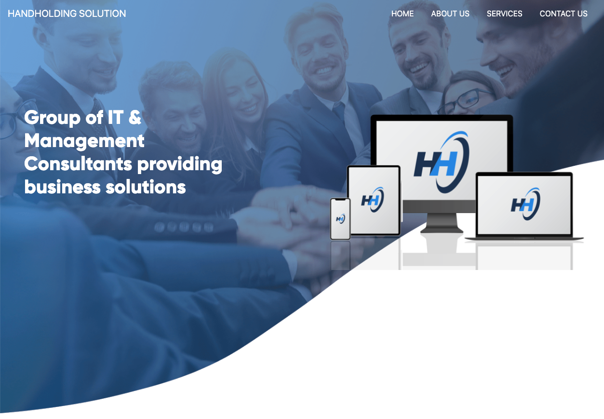
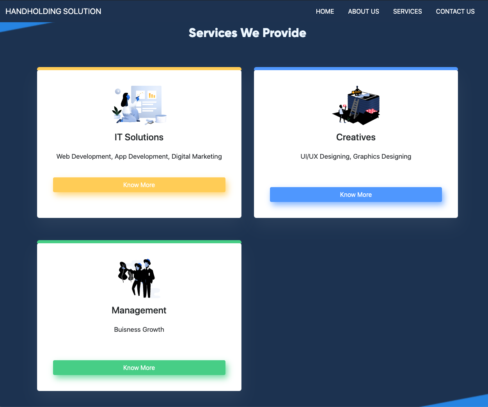
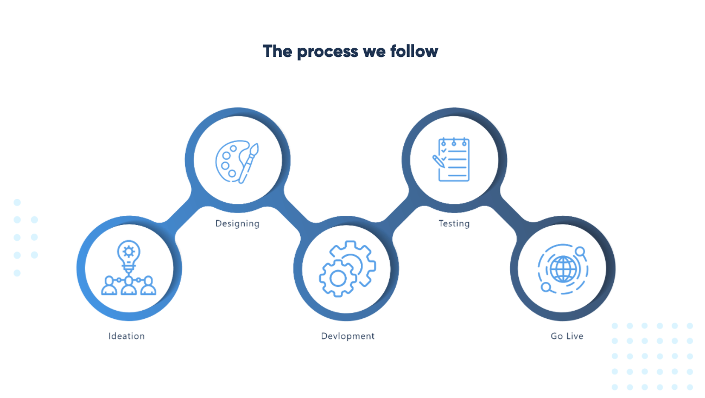

# HANDHOLDING SOLUTION

## ❔ About

Group of IT & Management Consultants providing business solutions

We are a Team of Young Professionals, Technology Experts, Creative Designers, Management Consultants, Certified Chartered Accountants & Lawyers who are Passionate about Innovation and Providing Digital Solutions to grow your business and help you in establishing
your digital identity in the market. We also provide documentation support, financial management & risk analysis.

We always provide HANDHOLDING support to our clients and help them to achieve their goals. We provide clients with a wide range of services that will help them thrive and grow. Whether it’s project planning, business analysis
or crisis management - We are here for our clients. We know that sometimes things can get challenging, and we are here to ease the load off your shoulders from day one. If you’d like to learn more about how our consulting services
can help you or your business grow, book an introductory meeting today!!

## 📸 Screenshots

<b>Homepage</b>

  

<b>Our Services</b>

  

<b>Our Process</b>

  

## 🛠 Our Tech Stack

### Web Development

- HTML
- CSS
- Javascript
- React
- Angular
- Node Js
- Django
- PHP
- WordPress

### App Development

- Swift
- Java
- Flutter
- React Native
- Ionic

### Graphic Designing

- Adobe Photoshop
- Sketch
- Adobe Illustrator
- Affinity Designer
- Adobe InDesign

### UI/UX Development

- InVision Studio
- Axure
- Craft
- Adobe XD

## 📜 License

This project is underApache License [Apache](./LICENSE)
